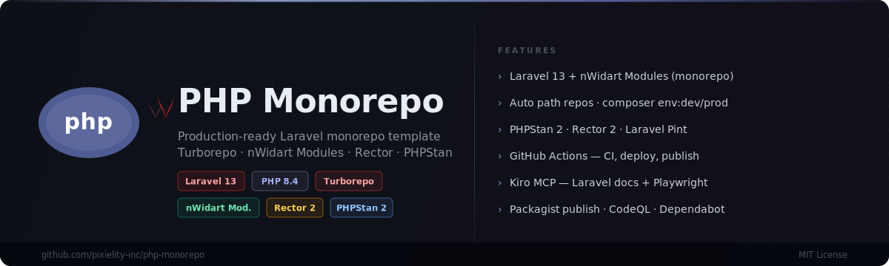

<div align="center">
  
</div>

<div align="center">

[](https://github.com/pixielity-inc/php-monorepo/actions/workflows/ci.yml)
[](https://github.com/pixielity-inc/php-monorepo/actions/workflows/security.yml)
[](https://php.net)
[](https://laravel.com)
[](LICENSE)

**A production-ready PHP/Laravel monorepo template powered by [Turborepo](https://turborepo.dev).**
Batteries included: nWidart Modules, Rector, PHPStan, Pint, CI/CD, git hooks, and MCP.

[Quick Start](#quick-start) · [Structure](#structure) · [Commands](#commands) · [Modules](#modules) · [Environment](#environment-management) · [CI/CD](#cicd) · [Contributing](CONTRIBUTING.md)

</div>

---

## Structure

```
php-monorepo/
├── applications/
│   └── example-app/          # Laravel 13 application
│       ├── app/               # Controllers, Models, Services, Jobs…
│       ├── config/modules.php # nWidart Modules config → ../../modules
│       ├── composer.json      # pixielity/example-app
│       └── package.json       # Turbo task integration (PHP scripts only)
├── modules/
│   └── core/                  # Shared PHP library → pixielity/laravel-core
│       ├── src/               # Pixielity\Core namespace
│       ├── module.json        # nWidart module descriptor
│       ├── composer.json
│       └── turbo.json
├── scripts/
│   ├── ComposerScripts.php    # env:*, repos:* commands
│   └── WorkspaceDiscovery.php # Dynamic workspace scanner
├── .github/
│   ├── assets/banner.svg
│   ├── workflows/
│   │   ├── ci.yml             # PHP 8.2/8.3/8.4 matrix · lint · test
│   │   ├── cd_deploy.yml      # Deploy via rsync/SSH on main + v* tags
│   │   ├── cd_publish.yml     # Publish modules to Packagist on module tags
│   │   ├── release.yml        # GitHub Release on v* tags
│   │   └── security.yml       # Weekly Composer/npm audit + CodeQL
│   ├── CODEOWNERS
│   ├── dependabot.yml
│   └── ISSUE_TEMPLATE/
├── .githooks/                 # pre-commit · commit-msg · pre-push
├── .kiro/settings/mcp.json    # Laravel docs · GitHub · Playwright
├── composer.json              # Root orchestrator (dynamic workspace discovery)
├── turbo.json                 # Turborepo pipeline
├── package.json               # npm workspaces root
├── phpstan.neon               # PHPStan level 8
├── pint.json                  # Laravel Pint PSR-12 rules
└── rector.php                 # Rector PHP 8.4 + Laravel 13 rule sets
```

---

## Quick start

```bash
# 1. Clone
git clone https://github.com/pixielity-inc/php-monorepo.git
cd php-monorepo

# 2. Install JS deps + register git hooks
npm install

# 3. Switch to dev environment (sets stability, .env vars, syncs path repos)
composer env:dev

# 4. Install all Composer workspaces
composer install:all

# 5. Prepare the Laravel app
cp applications/example-app/.env.example applications/example-app/.env
php applications/example-app/artisan key:generate
php applications/example-app/artisan migrate

# 6. Start dev server
npm run dev
```

---

## Commands

### Root (npm — runs across all workspaces via Turborepo)

| Command | Description |
|---|---|
| `npm run build` | Install Composer deps in all workspaces |
| `npm run dev` | Start all dev servers |
| `npm run test` | Run PHPUnit across all workspaces |
| `npm run lint` | Run Pint `--test` across all workspaces |
| `npm run lint:fix` | Run Pint (auto-fix) across all workspaces |
| `npm run analyse` | Run PHPStan across all workspaces |
| `npm run refactor` | Rector dry-run across all workspaces |
| `npm run refactor:fix` | Rector apply across all workspaces |
| `npm run clean` | Remove build artefacts |
| `npm run upgrade` | `ncu -u && npm install` |

Filter to a single workspace:

```bash
npm run test -- --filter=@pixielity/example-app
npm run lint -- --filter=@pixielity/laravel-core
```

### Root (Composer — dynamic workspace discovery)

| Command | Description |
|---|---|
| `composer workspaces:list` | List all discovered workspaces |
| `composer env:dev` | Switch all workspaces to dev environment |
| `composer env:testing` | Switch all workspaces to testing environment |
| `composer env:prod` | Switch all workspaces to production environment |
| `composer env:status` | Show current env state across all workspaces |
| `composer repos:sync` | Auto-register all module path repositories |
| `composer repos:check` | Dry-run: list unregistered module paths |
| `composer install:all` | `composer install` in every workspace |
| `composer update:all` | `composer update` in every workspace |
| `composer test:all` | Run tests in every workspace |
| `composer lint:all` | Run Pint in every workspace |

### Per-workspace (Composer)

```bash
# From applications/example-app or modules/core:
composer env:dev        # Switch this workspace to dev
composer env:prod       # Switch this workspace to prod
composer env:status     # Show this workspace's env state
composer repos:sync     # Sync path repos for this workspace
composer repos:check    # Check path repos for this workspace
composer test           # Run PHPUnit
composer lint           # Pint --test
composer lint:fix       # Pint (auto-fix)
composer analyse        # PHPStan
composer refactor       # Rector --dry-run
composer refactor:fix   # Rector apply
```

---

## Environment management

The `ComposerScripts` system manages environment switching without hardcoding workspace paths. It discovers all workspaces dynamically.

### Presets

| Preset | `minimum-stability` | `APP_ENV` | `APP_DEBUG` | Cache | Queue | Mail |
|---|---|---|---|---|---|---|
| `dev` | `dev` | `local` | `true` | `array` | `sync` | `log` |
| `testing` | `dev` | `testing` | `true` | `array` | `sync` | `array` |
| `prod` | `stable` | `production` | `false` | `redis` | `redis` | `smtp` |

### Path repositories

`repos:sync` scans three glob depths and adds missing entries with `symlink: true`:

```
modules/*          → e.g. modules/core
modules/*/*        → e.g. modules/pixielity/auth
modules/*/*/*      → e.g. modules/pixielity/group/auth
```

This runs automatically on every `composer install` and `composer update` via the `ensureRepositories` lifecycle hook.

---

## Modules

Modules live in `modules/` and are discovered automatically by both nWidart/laravel-modules and the `ComposerScripts` path repository system.

### Adding a new module

```bash
# 1. Create the module directory
mkdir -p modules/my-module/src

# 2. Copy modules/core as a template, update:
#    - composer.json: name → pixielity/laravel-my-module
#    - module.json: name, alias, providers
#    - src/ namespace: Pixielity\MyModule

# 3. Sync path repositories
composer repos:sync

# 4. Require it in your application
composer require pixielity/laravel-my-module --working-dir=applications/example-app
```

### Publishing a module to Packagist

```bash
# 1. Bump version in modules/<name>/composer.json
# 2. Update modules/<name>/CHANGELOG.md
git add . && git commit -m "chore(core): bump to 1.2.3"
git tag core-v1.2.3 && git push --tags
# cd_publish.yml handles the rest
```

---

## Adding a new application

```bash
laravel new applications/my-app --no-interaction
# Add package.json with "name": "@pixielity/my-app" and turbo tasks
npm install
composer env:dev  # auto-registers all module path repos
```

---

## CI/CD

| Workflow | Trigger | What it does |
|---|---|---|
| `ci.yml` | PR + push to `main/develop` | PHP 8.2/8.3/8.4 matrix · Composer cache · lint · test · Codecov |
| `cd_deploy.yml` | Push to `main` + `v*` tags | Build prod assets · rsync/SSH deploy · artisan post-deploy |
| `cd_publish.yml` | Tag `<module>-v*` | CI gate → version validate → Packagist webhook → GitHub Release |
| `release.yml` | Tag `v*` | Auto-generate GitHub Release notes |
| `security.yml` | Weekly + push to `main` | Composer/npm audit · CodeQL (PHP + JS) |

### Required secrets

| Secret | Workflow | Description |
|---|---|---|
| `CODECOV_TOKEN` | ci.yml | [codecov.io](https://codecov.io) token |
| `DEPLOY_SSH_KEY` | cd_deploy.yml | Private SSH key for deploy server |
| `DEPLOY_HOST` | cd_deploy.yml | Server hostname |
| `DEPLOY_USER` | cd_deploy.yml | SSH username |
| `DEPLOY_PATH` | cd_deploy.yml | Absolute path on server |
| `PACKAGIST_USERNAME` | cd_publish.yml | Packagist username |
| `PACKAGIST_TOKEN` | cd_publish.yml | Packagist API token |

---

## MCP servers (Kiro)

Configured in `.kiro/settings/mcp.json`:

| Server | Package | Purpose |
|---|---|---|
| `laravel` | `mcp-remote` → gitmcp.io/laravel/laravel | Live Laravel docs |
| `github` | `@modelcontextprotocol/server-github` | Repo operations |
| `playwright` | `@playwright/mcp` | Browser testing |

---

## License

MIT © [Pixielity](https://github.com/pixielity-inc)
